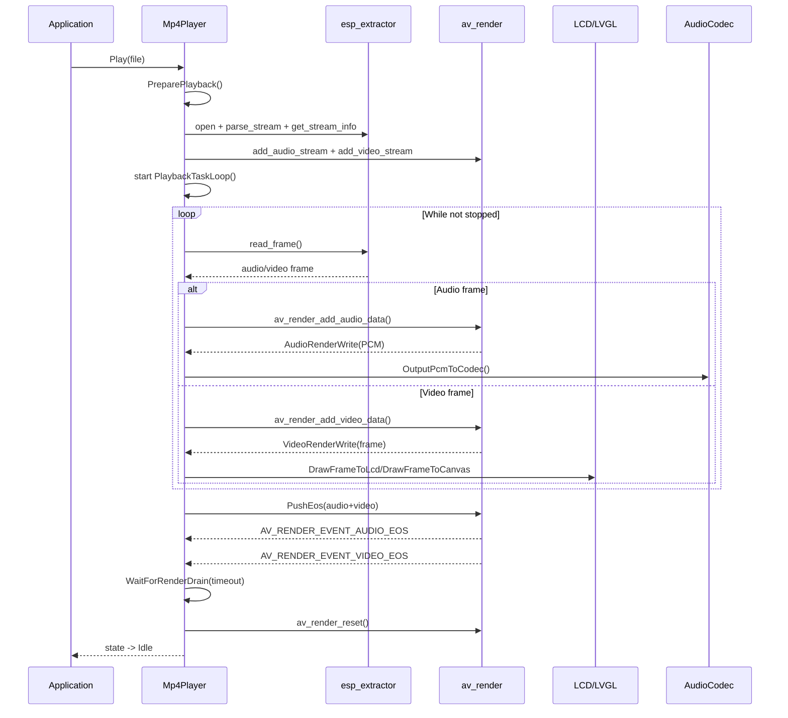

# MP4 Player Feature — MP4 Playback with esp_extractor + av_render

## Overview

This component provides MP4 playback from SD card and runs audio/video pipelines through `av_render`.

- Container: MP4
- Audio codec accepted: AAC, MP3, FLAC
- Video codec accepted: H264, MJPEG
- Render output:
    - `DirectLcd`: draw RGB565 frames directly to panel
    - `LvglCanvas`: draw frames into LVGL canvas, with LCD fallback if canvas path fails

The player runs in its own FreeRTOS task and coexists with other media features.

## Files

| File | Description |
|------|-------------|
| `features/mp4/mp4_player.h` | `Mp4Player` API, state machine, playlist, callbacks |
| `features/mp4/mp4_player.cc` | MP4 extraction, stream setup, AV render integration, LCD/LVGL output |
| `features/mp4/mp4.md` | This document |
| `application.h` | `Mp4Player*`, init/play entry points, media integration |
| `application.cc` | App lifecycle wiring for MP4 start/stop alongside other media |

## Playback Pipeline

```text
SD card file (.mp4)
    -> esp_extractor (demux)
        -> compressed audio/video packets
            -> av_render queues
                -> audio decode + render callback (PCM)
                    -> AudioCodec::OutputData()
                -> video decode + render callback (RGB565/RGB565_BE)
                    -> Direct LCD draw OR LVGL canvas draw
```

## Sequence Diagram



## End-Of-Stream Handling

To avoid ending playback too early near the tail of file:

1. EOS marker is pushed to both audio and video queues (`PushEos`).
2. Player waits for render drain (`WaitForRenderDrain`) by checking:
     - `AV_RENDER_EVENT_AUDIO_EOS` and `AV_RENDER_EVENT_VIDEO_EOS`, or
     - both audio/video FIFO levels become empty.
3. Only after drain, player calls `av_render_reset` and transitions to `Idle`.

This prevents truncation where EOS is observed but queued tail frames are not fully rendered yet.

## Directory Layout

Default scan directory is:

```text
/sdcard/videos/*.mp4
```

`ScanDirectory()` lists regular `.mp4` files, sorts by filename, and stores up to `MP4_MAX_FILES` entries.

## Public API (Typical)

```cpp
Mp4Player& player = Mp4Player::GetInstance();

player.Initialize(panel, lcd_w, lcd_h, codec, sd_card, display, Mp4RenderMode::DirectLcd);
player.SetDirectory("videos");
player.ScanDirectory();
player.PlayFile("demo.mp4");
player.Pause();
player.Resume();
player.Stop();
```

## Notes and Limits

- No scaling stage is implemented in this module; source should fit display constraints.
- Output expects RGB565 path from render callbacks.
- Supported codec map is fixed by `MapAudioCodec` and `MapVideoCodec`.

## Convert MP4 for Device Playback

Use this ffmpeg command to convert a source MP4 to a device-friendly file
(320x240, 10 FPS, H264 baseline, GOP 10):

```bash
ffmpeg -i cmnq.mp4 -vf "scale=320:240,fps=10" -c:v libx264 -profile:v baseline -level 2.0 -g 10 -pix_fmt yuv420p -b:v 500k video_30s_cmnq.mp4
```

Quick notes:

- Keep output under `/sdcard/videos/` so `ScanDirectory()` can find it.
- If playback is unstable, reduce bitrate further (for example: `-b:v 300k`).

## Troubleshooting

- Playback ends too early:
    - check logs for `PushEos`, `AV_RENDER_EVENT_*_EOS`, and `WaitForRenderDrain` timeout messages.
- No video:
    - verify track codec is H264 or MJPEG.
    - verify display mode (`DirectLcd` vs `LvglCanvas`) and panel/display pointers are valid.
- No audio:
    - verify audio track codec is AAC/MP3/FLAC.
    - verify board codec is enabled and output sample-rate reconfiguration succeeds.
- Scan returns empty:
    - verify files are under `/sdcard/videos/` and extension is `.mp4`.
